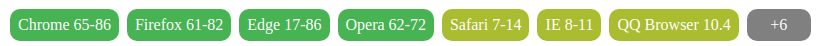
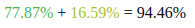

# caniuse-web-component

all components are bundled in `can-i-use.js`
```html
<script defer src="/can-i-use.js"></script>
```

# can-i-use

A web component that shows browser support in a compact form.



<!--
```
<custom-element-demo>
  <template>
    <script defer src="can-i-use.js"></script>
    <next-code-block></next-code-block>
  </template>
</custom-element-demo>
```
-->

```html
<can-i-use
  type="custom-elementsv1"
  browsers="['firefox', 'chrome', 'edge' , 'safari', 'ie', 'opera']"
></can-i-use>
```

# can-i-use-total

A web component that shows the support percentage for full support, partial support and total support.



<!--
```
<custom-element-demo>
  <template>
    <script defer src="can-i-use.js"></script>
    <next-code-block></next-code-block>
  </template>
</custom-element-demo>
```
-->

```html
<can-i-use-total type="custom-elementsv1"></can-i-use-total>
```

## development

```bash
npm run dev
```

Navigate to [localhost:5000](http://localhost:5000)
